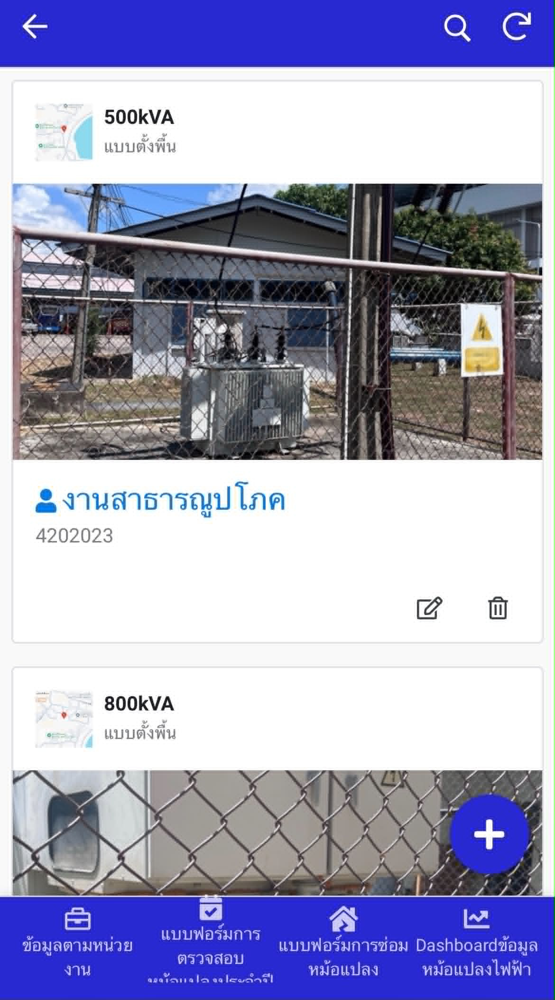
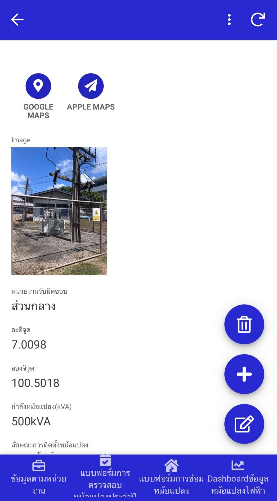
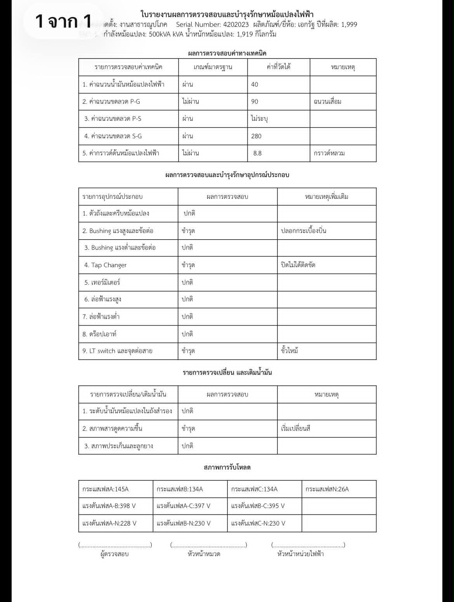

# Transformer Location & Data Management Application

**Internship Project | AppSheet · Google Sheets · Google Maps · Data Management**

โครงงานฝึกงาน ณ กองกายภาพและสิ่งแวดล้อม  
มหาวิทยาลัยสงขลานครินทร์ วิทยาเขตหาดใหญ่

## Project Overview

โครงงานนี้เป็นการพัฒนาแอปพลิเคชันสำหรับจัดเก็บและบริหารจัดการข้อมูลหม้อแปลงไฟฟ้า
เพื่อรวบรวมข้อมูลทรัพย์สิน การตรวจสอบ และการบำรุงรักษาให้อยู่ในระบบเดียวกัน
ช่วยให้สามารถค้นหา ตรวจสอบ อัปเดต และติดตามข้อมูลได้สะดวกมากขึ้น

ระบบพัฒนาด้วย AppSheet โดยใช้ Google Sheets เป็นแหล่งจัดเก็บข้อมูล
พร้อมรองรับการใช้งานภาคสนามผ่านพิกัด GPS และการนำทางด้วย Google Maps
รวมถึงการบันทึกข้อมูลผ่านแบบฟอร์มดิจิทัล การสร้างรายงาน PDF อัตโนมัติ
และ Dashboard สำหรับติดตามข้อมูล

## Key Features

- จัดเก็บข้อมูลหม้อแปลง การตรวจสอบ และการบำรุงรักษาไว้ในระบบเดียวกัน
- ค้นหาและตรวจสอบข้อมูลหม้อแปลงตามหน่วยงานและตำแหน่งติดตั้ง
- แสดงพิกัด GPS และรองรับการนำทางไปยังตำแหน่งหม้อแปลง
- บันทึกข้อมูลการตรวจสอบและการบำรุงรักษาผ่านแบบฟอร์มดิจิทัล
- รองรับการบันทึกข้อมูลผ่านโทรศัพท์มือถือสำหรับการปฏิบัติงานภาคสนาม
- สร้างรายงาน PDF สำหรับข้อมูลการตรวจสอบและการบำรุงรักษาโดยอัตโนมัติ
- แสดงข้อมูลผ่าน Dashboard เพื่อช่วยในการติดตามและบริหารจัดการข้อมูล
- รองรับการเข้าถึงระบบผ่าน QR Code

## Technologies Used

- AppSheet
- Google Sheets / Excel
- Google Maps
- QR Code
- Data Management

## Data Preparation

รวบรวมและเตรียมข้อมูลหม้อแปลงก่อนนำเข้าสู่ระบบ
โดยตรวจสอบความถูกต้อง ลบข้อมูลซ้ำ และจัดรูปแบบตารางให้เหมาะสมกับการใช้งาน
เป็นฐานข้อมูล จากนั้นนำข้อมูลจาก Excel ไปยัง Google Sheets
เพื่อใช้เป็นแหล่งข้อมูลสำหรับระบบ AppSheet

## System Workflow

1. เข้าสู่ระบบและเลือกหน่วยงาน
2. ค้นหาและเลือกหม้อแปลงที่ต้องการ
3. ตรวจสอบรายละเอียดและตำแหน่งติดตั้ง
4. ใช้ GPS / Google Maps เพื่อนำทางไปยังพื้นที่จริง
5. บันทึกข้อมูลการตรวจสอบหรือการบำรุงรักษาผ่านโทรศัพท์มือถือ
6. จัดเก็บและเชื่อมโยงประวัติข้อมูล
7. สร้างรายงาน PDF อัตโนมัติ
8. ติดตามข้อมูลผ่าน Dashboard

## My Responsibilities

- เตรียม ตรวจสอบ และจัดโครงสร้างข้อมูลหม้อแปลงสำหรับนำไปพัฒนาระบบ
- พัฒนาแอปพลิเคชันจัดการข้อมูลด้วย AppSheet และ Google Sheets
- เชื่อมโยงพิกัด GPS และการนำทางด้วย Google Maps
- พัฒนาแบบฟอร์มดิจิทัลสำหรับการตรวจสอบและการบำรุงรักษา
- พัฒนาระบบสร้างรายงาน PDF อัตโนมัติ
- พัฒนา Dashboard สำหรับติดตามและแสดงผลข้อมูล

## Project Poster

โปสเตอร์สรุปภาพรวมของโครงงาน แนวทางการพัฒนา ฟังก์ชันการทำงาน
และเครื่องมือที่ใช้ในการพัฒนาระบบ

📄 [View Project Poster (PDF)](transformer-data-management-poster.pdf)

## Application Screenshots

ตัวอย่างหน้าจอการทำงานของระบบ ตั้งแต่การจัดการข้อมูลหม้อแปลง
การตรวจสอบตำแหน่ง การนำทาง การบันทึกข้อมูลภาคสนาม
ไปจนถึงการสร้างรายงานและ Dashboard

### 1. Organization List
แสดงรายการหน่วยงานสำหรับจัดกลุ่มและค้นหาข้อมูลหม้อแปลงตามหน่วยงานที่รับผิดชอบ

### 2. Transformer List
แสดงรายการหม้อแปลง พร้อมข้อมูลเบื้องต้น เช่น ขนาดหม้อแปลง ตำแหน่งติดตั้ง และหน่วยงานที่รับผิดชอบ

### 3. Transformer Details
แสดงรายละเอียดของหม้อแปลง เช่น รูปภาพ หน่วยงานที่รับผิดชอบ พิกัด GPS กำลังหม้อแปลง และข้อมูลการติดตั้ง

### 4. Location Navigation
รองรับการนำทางจากตำแหน่งปัจจุบันไปยังพื้นที่ติดตั้งหม้อแปลงผ่าน Google Maps

### 5. Transformer Map
แสดงตำแหน่งหม้อแปลงบนแผนที่ เพื่อช่วยค้นหาและตรวจสอบตำแหน่งของหม้อแปลงในพื้นที่

### 6. Inspection Form
แบบฟอร์มดิจิทัลสำหรับบันทึกข้อมูลการตรวจสอบหม้อแปลงและข้อมูลที่เกี่ยวข้องผ่านอุปกรณ์มือถือ

### 7. Installation Location List
แสดงรายการตำแหน่งติดตั้ง เพื่อช่วยเลือกและค้นหาหม้อแปลงตามพื้นที่หรือจุดติดตั้ง

### 8. Inspection Report
ตัวอย่างรายงานผลการตรวจสอบและบำรุงรักษาหม้อแปลงที่สร้างจากข้อมูลในระบบ

### 9. Transformer Dashboard
Dashboard สำหรับสรุปและแสดงข้อมูลหม้อแปลง เช่น ลักษณะการติดตั้งและข้อมูลจำแนกตามผลิตภัณฑ์หรือยี่ห้อ

> **Note:** ข้อมูลภายในหน่วยงาน ข้อมูลพิกัด และข้อมูลที่มีความละเอียดอ่อน
> ถูกนำออกหรือปกปิดก่อนนำมาใช้เพื่อแสดงผลงานใน Portfolio

