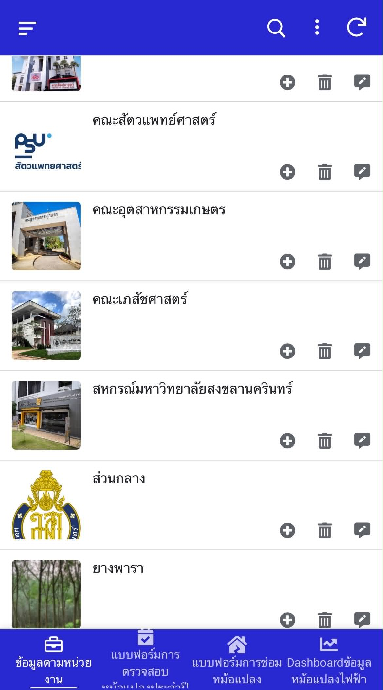
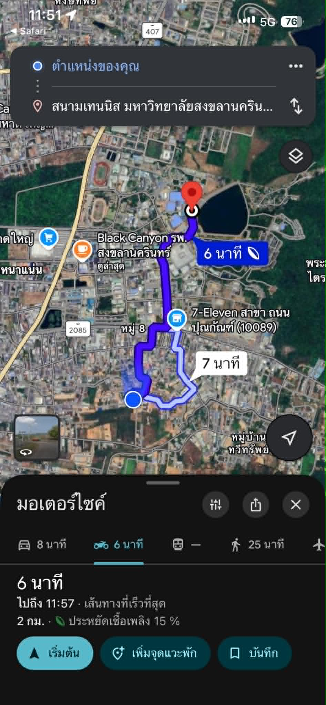
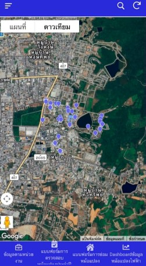
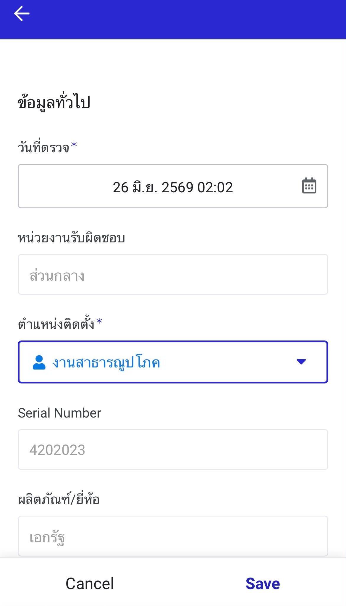
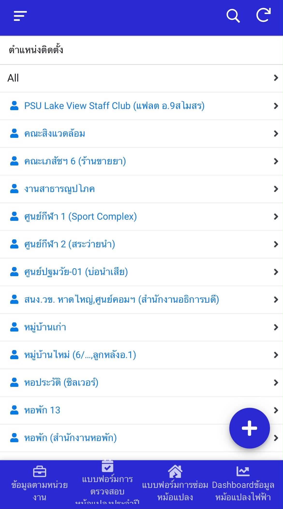
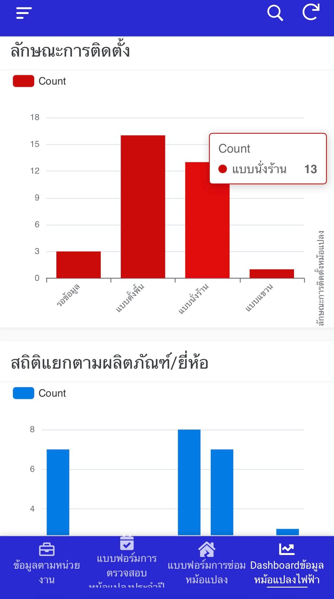

# Transformer Location & Data Management Application

**Internship Project | AppSheet · Google Sheets · Google Maps · Data Management**

โครงงานฝึกงาน ณ กองกายภาพและสิ่งแวดล้อม  
มหาวิทยาลัยสงขลานครินทร์ วิทยาเขตหาดใหญ่

## Project Overview

โครงงานนี้เป็นการพัฒนาแอปพลิเคชันสำหรับจัดเก็บและบริหารจัดการข้อมูลหม้อแปลงไฟฟ้า เพื่อรวบรวมข้อมูลหม้อแปลง การตรวจสอบ และการบำรุงรักษาให้อยู่ในระบบเดียวกัน ช่วยให้สามารถค้นหา ตรวจสอบ อัปเดต และติดตามข้อมูลได้สะดวกมากขึ้น

ระบบพัฒนาด้วย AppSheet โดยใช้ Google Sheets เป็นแหล่งจัดเก็บข้อมูล รองรับการใช้งานภาคสนาม โดยใช้พิกัด GPS สำหรับระบุตำแหน่งและเชื่อมโยงการนำทางผ่าน Google Maps รวมถึงการบันทึกข้อมูลผ่านแบบฟอร์มดิจิทัล การสร้างรายงาน PDF และ Dashboard สำหรับสรุปและติดตามข้อมูล

## Key Features

- จัดเก็บข้อมูลหม้อแปลง การตรวจสอบ และการบำรุงรักษาไว้ในระบบเดียวกัน
- ค้นหาและตรวจสอบข้อมูลหม้อแปลงตามหน่วยงานและตำแหน่งติดตั้ง
- แสดงพิกัด GPS และเชื่อมโยงการนำทางไปยังตำแหน่งหม้อแปลงผ่าน Google Maps
- บันทึกข้อมูลการตรวจสอบและการบำรุงรักษาผ่านแบบฟอร์มดิจิทัล
- รองรับการบันทึกข้อมูลผ่านโทรศัพท์มือถือสำหรับการปฏิบัติงานภาคสนาม
- สร้างรายงาน PDF จากข้อมูลการตรวจสอบและการบำรุงรักษา
- แสดงข้อมูลผ่าน Dashboard เพื่อช่วยในการสรุปและติดตามข้อมูล
- รองรับการเข้าถึงระบบผ่าน QR Code

## Technologies Used

- AppSheet
- Google Sheets
- Microsoft Excel
- Google Maps
- QR Code
- Data Management

## Data Preparation

ก่อนนำข้อมูลเข้าสู่ระบบ มีการตรวจสอบความถูกต้อง ลบข้อมูลซ้ำ และจัดรูปแบบตารางให้เหมาะสมกับการนำไปใช้งาน

ข้อมูลเดิมจาก Microsoft Excel ถูกจัดเตรียมและนำเข้าสู่ Google Sheets เพื่อใช้เป็นแหล่งข้อมูลหลักสำหรับแอปพลิเคชันที่พัฒนาด้วย AppSheet

## System Workflow

1. เข้าสู่ระบบและเลือกหน่วยงาน
2. ค้นหาและเลือกหม้อแปลงที่ต้องการ
3. ตรวจสอบรายละเอียดและตำแหน่งติดตั้ง
4. ใช้พิกัด GPS และ Google Maps เพื่อนำทางไปยังพื้นที่ติดตั้ง
5. บันทึกข้อมูลการตรวจสอบหรือการบำรุงรักษาผ่านโทรศัพท์มือถือ
6. จัดเก็บและเชื่อมโยงประวัติการตรวจสอบ
7. สร้างรายงาน PDF จากข้อมูลที่บันทึกในระบบ
8. สรุปและติดตามข้อมูลผ่าน Dashboard

## My Responsibilities

- เตรียม ตรวจสอบ และจัดโครงสร้างข้อมูลหม้อแปลงก่อนนำเข้าสู่ระบบ
- พัฒนาแอปพลิเคชันจัดการข้อมูลด้วย AppSheet และ Google Sheets
- เชื่อมโยงพิกัด GPS กับการนำทางผ่าน Google Maps
- พัฒนาแบบฟอร์มดิจิทัลสำหรับบันทึกข้อมูลการตรวจสอบและการบำรุงรักษา
- พัฒนาระบบสร้างรายงาน PDF จากข้อมูลที่บันทึกในระบบ
- พัฒนา Dashboard สำหรับสรุปและแสดงผลข้อมูล

## Project Poster

โปสเตอร์สรุปภาพรวมของโครงงาน แนวทางการพัฒนา ฟังก์ชันการทำงาน และเครื่องมือที่ใช้ในการพัฒนาระบบ

📄 [View Project Poster (PDF)](transformer-data-management-poster.pdf)

## Application Screenshots

ตัวอย่างหน้าจอการทำงานของระบบ ตั้งแต่การค้นหาและตรวจสอบข้อมูลหม้อแปลง การดูตำแหน่งและการนำทาง การบันทึกข้อมูลภาคสนาม ไปจนถึงการสร้างรายงานและ Dashboard

### 1. Organization List

แสดงรายการหน่วยงานสำหรับจัดกลุ่มและค้นหาข้อมูลหม้อแปลงตามหน่วยงานที่รับผิดชอบ

<p align="center">
  
</p>

### 2. Transformer List

แสดงรายการหม้อแปลง พร้อมข้อมูลเบื้องต้น เช่น ขนาดหม้อแปลง ตำแหน่งติดตั้ง และหน่วยงานที่รับผิดชอบ

<p align="center">
  
</p>

### 3. Transformer Details

แสดงรายละเอียดของหม้อแปลง เช่น รูปภาพ หน่วยงานที่รับผิดชอบ พิกัด GPS กำลังหม้อแปลง และข้อมูลการติดตั้ง

<p align="center">
  
</p>

### 4. Location Navigation

แสดงการนำทางจากตำแหน่งปัจจุบันไปยังพื้นที่ติดตั้งหม้อแปลงผ่าน Google Maps

<p align="center">
  
</p>

### 5. Transformer Map

แสดงตำแหน่งหม้อแปลงบนแผนที่ เพื่อช่วยในการค้นหาและตรวจสอบตำแหน่งของหม้อแปลงในพื้นที่

<p align="center">
  
</p>

### 6. Inspection Form

แบบฟอร์มดิจิทัลสำหรับบันทึกข้อมูลการตรวจสอบหม้อแปลงและข้อมูลที่เกี่ยวข้องผ่านโทรศัพท์มือถือ

<p align="center">
  
</p>

### 7. Installation Location List

แสดงรายการตำแหน่งติดตั้ง เพื่อช่วยค้นหาและเลือกหม้อแปลงตามพื้นที่หรือจุดติดตั้ง

<p align="center">
  
</p>

### 8. Inspection Report

ตัวอย่างรายงานผลการตรวจสอบและบำรุงรักษาหม้อแปลงที่สร้างจากข้อมูลที่บันทึกในระบบ

<p align="center">
  
</p>

### 9. Transformer Dashboard

Dashboard สำหรับสรุปและแสดงข้อมูลหม้อแปลง เช่น ลักษณะการติดตั้ง และข้อมูลจำแนกตามผลิตภัณฑ์หรือยี่ห้อ

<p align="center">
  
</p>

## Project Structure

```text
transformer-data-management-app/
│
├── README.md
├── transformer-data-management-poster.pdf
│
└── screenshots/
    ├── 01-organization-list.jpg
    ├── 02-transformer-list.jpg
    ├── 03-transformer-details.jpg
    ├── 04-location-navigation.jpg
    ├── 05-transformer-map.jpg
    ├── 06-inspection-form.jpg
    ├── 07-installation-location-list.jpg
    ├── 08-inspection-report.jpg
    └── 09-transformer-dashboard.jpg
```

## Project Type

**Internship Project — Data Management & Application Development with AppSheet**

โปรเจกต์นี้พัฒนาขึ้นระหว่างการฝึกงาน เพื่อประยุกต์ใช้การจัดการข้อมูลและการพัฒนาแอปพลิเคชันสำหรับสนับสนุนการจัดเก็บ ตรวจสอบ และติดตามข้อมูลหม้อแปลงไฟฟ้า

> **Note:** ข้อมูลภายในหน่วยงาน ข้อมูลพิกัด และข้อมูลที่มีความละเอียดอ่อนถูกนำออกหรือปกปิดก่อนนำมาใช้เพื่อแสดงผลงานใน Portfolio
